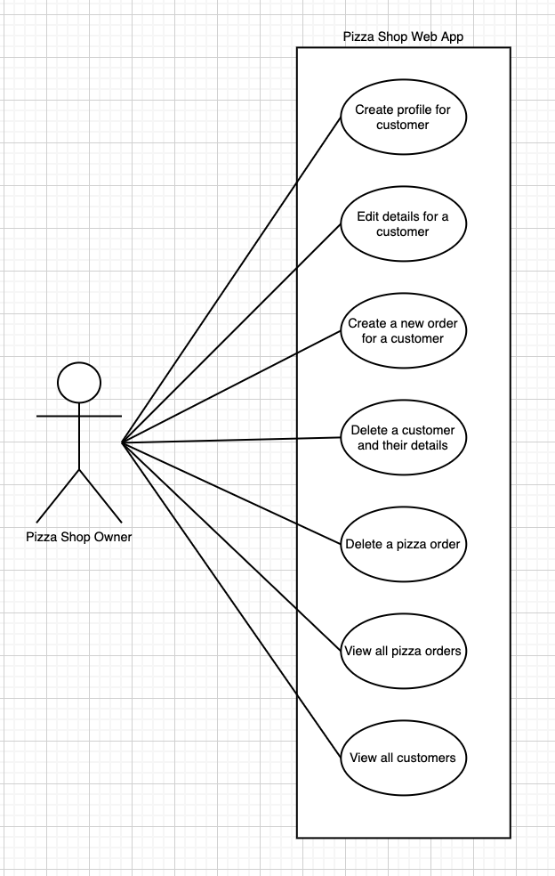
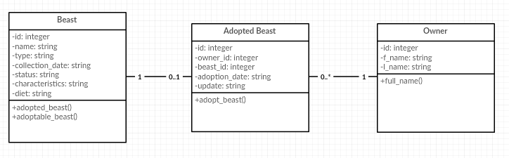
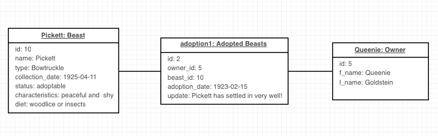
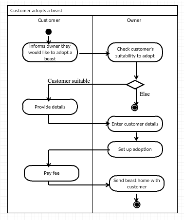
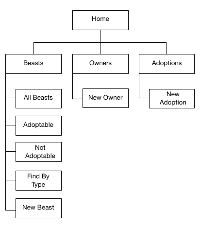
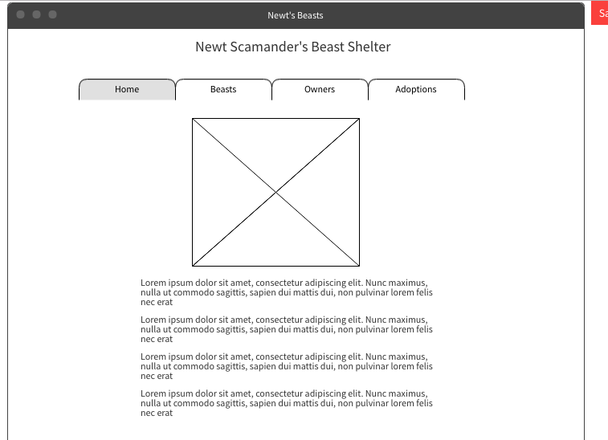
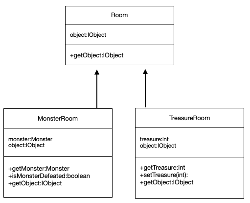
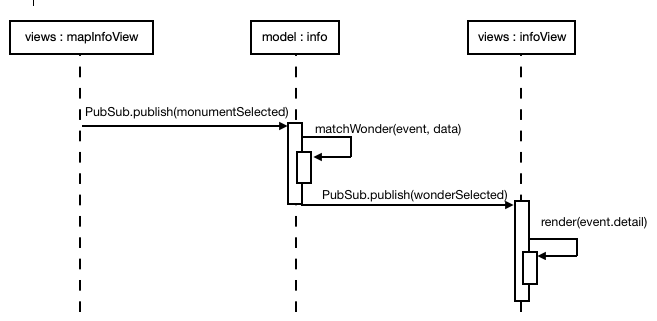
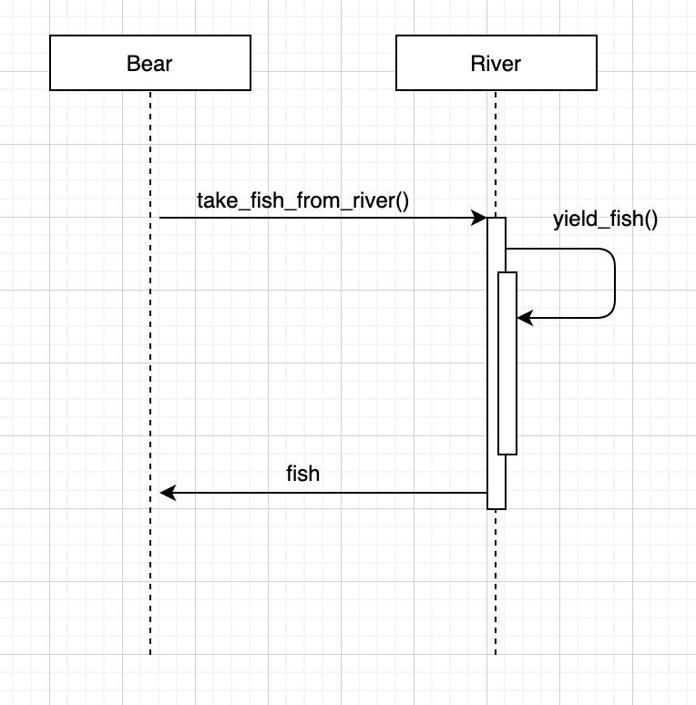
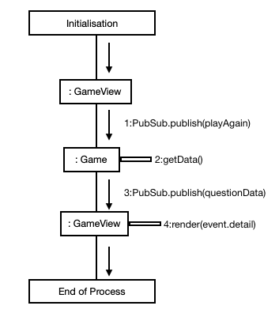

# PDA Marking Guide

## General Guidelines

- Everything the students submit must be their own work. They cannot use code that we have provided them in startpoints or lessons, etc. 

- The students need to provide a description for every assignment to demonstrate their understanding and provide context for images/diagrams.

- The code can be in any language.

- Uploads should not include draw.io files and any code should only be screenshots

## Evidence Gathering

## Week 2 

### I.T.6 - Hash in a program

Provide screenshots of:

- A hash in a program
- A funtion that uses the hash
- The result of the function running

The function can be simple or complex as long as they explicitly explain what it is doing. 
The result can be a passing test in terminal as long as they also show the test code. 
The result can be the result of the function printing out to the terminal.

### I.T.5 - Array in a program

Provide screenshots of:

- An array in a program
- A function that uses the array
- The result of the function running

The function can be simple or complex as long as they explicitly explain what it is doing. 
The result can be a passing test in terminal as long as they also show the test code. 
The result can be the result of the function printing out to the terminal.

## Week 3

### I.T.3 - Search in a program 

Provide screenshots of:

- A function that searches data
- The result of the function running

The search function can be a function that the student has written themselves or they can use an inbuilt function of the language but they need to use it in a function that they have written and accurately explain it.

### I.T.4 - Sorting in a program

Provide screenshots of: 

- A function that sorts data
- The result of the function running

The search function can be a function that the student has written themselves or they can use an inbuilt function of the language but they need to use it in a function that they have written and accurately explain it.

## Week 4 

### A.D.1 - Use Case Diagram

Provide screenshots of:

- A use case diagram

*Example Use Case Diagram*

Image must show the users of the system. If this is submitted and they have used their ruby project there should only be one user in the diagram.
The use cases should reflect the actions that a user can do within the program e.g. "Add Member"
The name of the app should be on the diagram to show the actions are part of the system.

### A.D.2 - Class Diagram

Provide screenshots of:

- A class diagram

*Example Class Diagram*

Image must show:

- at least two classes and the relationships between classes, arrows are not essential but lines are.
- class names
- variable names with their types e.g. name: String
- methods that belong to each class

### A.D.3 - Object Diagram

Provide screenshot of:

- An object diagram

*Example Object Diagram*

Image must show:

- at least two classes and the relationships between classes, arrows are not essential but lines are.
- classes must include an instance of that class showing example values for each variable.

### A.D.4 - Activity Diagram

Provide screenshot of:

- An activity diagram

*Example Activity Diagram*

Image must show:

- two distict systems or users/actors.
- black dot to indicate start of interaction.
- black dot in circle to indicate end of interaction.
- if there is a decision point this must be indicated with diamond and the options branching off of this.

### A.D.6 - Implementations and Constraints Plan

Provide an Implementations and Constraints Plan

They must include the following constraints:

- Hardware and Software platforms
- Performance Requirements
- Persistant Storage and Transactions
- Usability
- Budgets
- Time

In the Implementation Constraint column for each constraint the student must answer these 3 questions:

1. What could be a constraint on the product?
2. How could it be a constraint on the product?
3. Why is it a problem?

### P.5 - User Site Map

*Example Site Map*

Image must show:

- Navigation through the students app. 

### P.6 - 2 Wireframe Diagrams

Student must provide 2 diagrams. 

*Example Wireframe Diagram*

## Week 5

### P.10 - Pseudocode

Students must provide an example of pseudocode used for a method

### P.13 - User Input

Provide screenshots of:

- The user inputting something into the program
- The user input being saved or used in some way

Students should provide a screenshot of a form with user input.
Students should provide a screenshot of the data being saved in their program. Do not accept screenshots of the database as that is covered by P.14 - Data Persistence.

### P.14 - Data Persistence

Provide screenshots of:

- Data being inputted into the program
- Confirmation of the data being saved

Students should provide a screenshot of a form with the data being input.
Students should provide a screenshot of the data being saved in their program, this should be the data in the database to show data persistence.

### P.15 - Output and Feedback to User

Provide screenshots of:

- User requesting information or an action to be performed
- User request being processed correctly and demonstrated in the program

This could be: 

- The user clicking a link and being redirected to the correct page
- The user clicking a button and the correct action being performed
- The user using a search bar to filter data 

### P.11 - Project Information

Students should provide a screenshot of their project (this can be any page) or the github repo and the link to their github repo for this project. 

## Week 7 

### P.16 - API 

Provide screenshot of:

- Code that uses/implements the API
- The API being used by the program whilst running

Students should provide a screenshot that shows the API url in their code.
Students should provide a screenshot of their running app displaying data requested from the API.

## Week 8

### P.2 - Project Brief

Students should provide a screenshot of their project brief from the group project

### P.3 - Project Planning

Students should provide a screenshot of their planning from the group project.
This can include Trello boards, class diagrams, activity diagrams, etc.

### P.4 - Acceptance Criteria

Provide an acceptance criteria and test plan.

Students need to include at least 4 examples to demonstrate their ability to plan and test.

## Week 9

### P.1 - Github Contributors 

Students should provide a screenshot of the contributors page on Github for the group project repo. Must be with the team they worked with. If they have low or no contributions due to pair or mob programming, they should explain this in the description

Currently unless they have committed to master their contributions may not show up. In this case, reccommend to the student that they should make a small change or add to the README on master so they appear in the contributors page.

### P.12 - Planing Information

Students should provide screenshots of their planning and the different stages of development. 

This can include any diagrams, wireframes, Trello boards, pen and paper notes, etc.

## Week 11

### I.T.1 - Encapsulation

Screenshot of the use of encapsulation in a program and what it is doing.

Students should show a class that contains public methods that use private variables.

### P.18 - Testing

Provide screenshots of:

- Test code
- Test code failing to pass
- Test code once errors have been corrected
- Test code passing

Test code failing to pass can be errors instead of fails.
Students need to show the code for the test that fails and the code that fails the test
Students need to show the code for test that passes and the code that passes the test with the corrections.

## Week 12

### I.T.7 - Polymorphism

Show use of Polymorphism in a program and what it is doing.

-- The student should provide screenshots which show how objects can be of different types but can be added to the same arraylist due to Polymorphism --

### A.D.5 - Inheritance Diagram

Provide a screenshot of an ineritance diagram.

*Example Inheritance Diagram*

Students need to show variables and methods in a child class that have been inherited from a parent class.
Students need to show arrows pointing from the child class to the parent class to show the inheritance relationship.

### I.T.2 - Inheritance Example

Provide screenshots of:

- A class
- A class that inherits from the previous class
- An object in the class that inherits
- A method that uses the information inherited from the class

Students need to show the parent class, its properties and any method that is going to be used in the child class for the example.
Students need to show the child class using the inheritance syntax.
Students need to show an instance of the child class using the method from the parent class.

## Week 14

### P.7 - System Interaction Diagrams

Provide two system interaction diagrams

Students can provide 2 sequence diagrams, 2 collaboration diagrams or a combination. 
Students need to show the method calls involved during a process within their program. 
Students need to indicate any internal methods with a arrow that points back to itself

Sequence Diagram: 

- Students should show any classes involved in the process with vertical dashed lines coming from the classes in boxes
- Students should show any information that is passed between classes or method calls with arrows and clear labels to show how and in what order their system functions 
- Students need to indicate information that is returned with a dotted line and a clear label

*Example class Diagram 1 - methods that don't return anything*

*Example class Diagram 2 - method that returns something*

Collaboration Diagram:

- Students need to show the order in which their system functions by showing the classes involved and what messages are sent between the systems objects.
- Students need to indicate the sequence by numbering the messages/method calls.
- Students must include the boxes and need to have the initialization and end of process boxes.

*Example Collaboration Diagram*

### P.8 - Two Object Diagrams

Provide two object diagrams

(Refer to A.D.3)

### P.9 - Algorithms

Provide screenshots of two algorithms that you have written (not from the group project)
- Write a short statement on why you have chosen these two algorithms

Students need to show some sort of logic that solves a problem in a program and accurately describe what it is doing. This can be as simple or complex as they like as long as they can explain what it is doing.

### P.17 - Bug Tracking 

Produce a bug tracking report. 

Students need to provide 5-6 examples of bugs or errors that they came across in one of their projects. These should include: 

- What was the bug/error
- What was the solution to fix the bug/error
- When the bug/error occurred

## Testing Exercises

## Static and Dynamic Testing Task

### Task 1 - Static Testing

Students need to have added comments to the md file highlighting any bugs that they identify.
There are 10 errors, the students do not need to identify all of them but do need to identify at least 6 to pass.

### Task 2 - Dynamic Testing

Students need to correct the errors that they found in the md in the card_game.rb.
Students need to write at least one test for each function found in the class in card_game.rb.

## Unit and Integration Testing Task

### Unit Tests

Check that the students have completed all the unit tests for the tasks 

### Integration Tests

Check that the students have written a test for each question. 
Pay attention to question 4 as they will need at least 4 different tests.
Check that they have attempted to handle dividing by zero and that their test reflects what actually happens.

